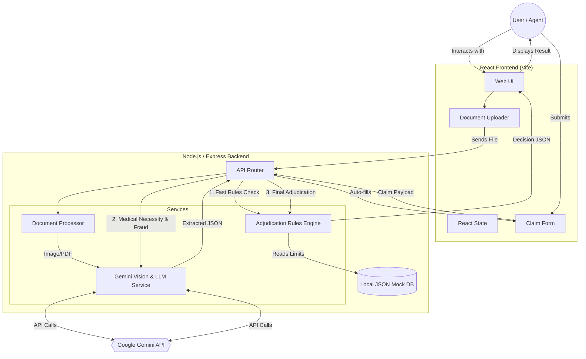

# Plum Insurance Automation System - Technical Documentation

This document serves as the comprehensive technical reference for the Plum Insurance Automation System MVP. It covers the technical approach, system architecture, API specifications, adjudication logic, and foundational assumptions.

---

## 1. Technical Approach

The system was designed as a hybrid **Deterministic Rules + Generative AI** pipeline. 

### Why this approach?
Insurance adjudication requires absolute mathematical precision for limits, copays, and exclusions, but requires "fuzzy" human-like reasoning to read messy handwritten prescriptions and evaluate clinical nuances (like whether Vitamin C is medically necessary for a fractured arm). 

To balance these needs, I built a two-stage pipeline:
1. **The Fast Deterministic Engine**: A highly optimized Node.js rules engine that instantly evaluates hard limits (e.g., ₹5000 per claim) and explicit exclusions (e.g., cosmetic surgery). It acts as a gatekeeper.
2. **The LLM Clinical Analyst**: Powered by Google's Gemini Flash 2.0. If the claim passes the mathematical gatekeeper, the LLM steps in to read the physical documents, detect invoice tampering, and assess the clinical justification of the prescribed medicines.

### Performance Optimization (Short-Circuiting)
To minimize latency and API costs, the system uses **Pre-Adjudication Short-Circuiting**. The Express router runs the cheap, deterministic rules engine *first*. If a claim is fundamentally invalid (e.g., missing a doctor's registration number), the system instantly aborts and rejects the claim without ever waking up the heavy LLM.

---

## 2. Architecture Diagram

The system is built as a monolithic client-server application, optimized for rapid inference and reliable rule-based processing.



---

## 3. Decision Logic Flowchart

The Adjudication Engine enforces a deterministic, priority-ordered pipeline. If a rejection condition is met at any phase, the engine short-circuits and immediately returns a `REJECTED` decision.

```mermaid
flowchart TD
    Start([Receive Claim Payload]) --> FraudCheck

    %% Step 0: Priority Fraud Check
    FraudCheck{0. Basic Fraud Patterns}
    FraudCheck -->|High Claim Vol/Val| ManualReview([MANUAL_REVIEW])
    FraudCheck -->|Safe| EligibilityCheck

    %% Step 1: Eligibility Check
    EligibilityCheck{1. Eligibility & Policy Status}
    EligibilityCheck -->|No Member ID/Name| Reject1([REJECTED: MEMBER_NOT_COVERED])
    EligibilityCheck -->|Late Submission| Reject1([REJECTED: LATE_SUBMISSION])
    EligibilityCheck -->|In Waiting Period| Reject1([REJECTED: WAITING_PERIOD])
    EligibilityCheck -->|Valid| DocumentCheck

    %% Step 2: Document Check
    DocumentCheck{2. Document Validation}
    DocumentCheck -->|No Prescription/Bill| Reject2([REJECTED: MISSING_DOCUMENTS])
    DocumentCheck -->|No Doctor Reg No.| Reject2([REJECTED: DOCTOR_REG_INVALID])
    DocumentCheck -->|Dates Don't Match| Reject2([REJECTED: DATE_MISMATCH])
    DocumentCheck -->|Patient Name Mismatch| Reject2([REJECTED: PATIENT_MISMATCH])
    DocumentCheck -->|Valid| CoverageCheck

    %% Step 3: Coverage Verification
    CoverageCheck{3. Coverage & Exclusions}
    CoverageCheck -->|Condition in Exclusions| Reject3([REJECTED: EXCLUDED_CONDITION])
    CoverageCheck -->|Alternative Med Not Allowed| Reject3([REJECTED: SERVICE_NOT_COVERED])
    CoverageCheck -->|Valid| LimitCheck

    %% Step 4: Limit Validation
    LimitCheck{4. Financial Limits}
    LimitCheck -->|Exceeds Annual Limit| Reject4([REJECTED: ANNUAL_LIMIT_EXCEEDED])
    LimitCheck -->|Exceeds Per-Claim Limit| Reject4([REJECTED: PER_CLAIM_EXCEEDED])
    LimitCheck -->|Exceeds Category Sub-Limit| Reject4([REJECTED: SUB_LIMIT_EXCEEDED])
    LimitCheck -->|Below Min ₹500 Amount| Reject4([REJECTED: BELOW_MIN_AMOUNT])
    LimitCheck -->|Valid| PartialCheck

    %% Partial Approval Check
    PartialCheck{Contains Excluded Items?}
    PartialCheck -->|Yes| SetPartial[Deduct items, Flag as PARTIAL]
    PartialCheck -->|No| KeepApproved[Keep as APPROVED]

    %% Final LLM Step
    SetPartial --> LLMCheck
    KeepApproved --> LLMCheck

    LLMCheck{5. Medical Necessity (LLM)}
    LLMCheck -->|Not Justified| Reject5([REJECTED: NOT_MEDICALLY_NECESSARY])
    LLMCheck -->|Justified| FinalCalculation

    FinalCalculation[6. Calculate Network Discounts] --> Output([Final Decision Output])
```

---

## 4. API Documentation

### Base URL
`http://localhost:5000/api`

### 1. Extract Document Data (`POST /claims/extract`)
Extracts structured information from raw uploaded files using Gemini Vision.
- **Payload**: `multipart/form-data` containing `files` array.
- **Response**: JSON object with pre-filled form fields.

### 2. Submit Claim for Adjudication (`POST /claims`)
Evaluates a normalized claim payload against the policy rules and LLM checks.
- **Payload**: JSON object containing member, hospital, and billing details.
- **Response**: Final `decision` (APPROVED/REJECTED/PARTIAL/MANUAL_REVIEW), `approvedAmount`, `rejectionReasons`, and `notes`.

### 3. Run Pre-Configured Test Case (`POST /claims/test/:caseId`)
Executes the engine against one of the pre-configured mock scenarios.
- **Path Param**: `caseId` (e.g., TC001)
- **Response**: Comparison between `expectedResult` and `actualResult`.

### 4. Get Policy Rules (`GET /policy/rules`)
Fetches the current policy rules and limits for display on the frontend.

### 5. Get Test Cases (`GET /test-cases`)
Returns the list of 10 test cases to populate the frontend dashboard.

---

## 5. List of Assumptions

Given the scope of the MVP and the absence of a live relational database, the system operates under the following key assumptions:

1. **The React Form Acts as the "Database"**: Since there is no SQL database to store member data, the system treats the React form inputs as the absolute source of truth. If a user uploads a prescription but the `Member Name` field is blank, the system assumes the user does not exist and throws `MEMBER_NOT_COVERED`.
2. **Generative AI Consistency**: The document processor relies on Google's Gemini API. We assume the API will return JSON in a structured format. Heavy fallback logic exists to coerce the text if the LLM drops the schema wrapper, but there is still an assumption of formatting adherence.
3. **Date Parsing**: The backend assumes that treatment dates are passed in standard ISO or `YYYY-MM-DD` formats. It calculates time differences assuming UTC or local server time offsets will not create edge-case off-by-one errors.
4. **Deterministic Limits Override Contextual Decisions**: Hard mathematical limits cannot be exceeded. If a highly-necessary medical procedure costs ₹8000 but the per-claim limit is ₹5000, the system aggressively truncates or rejects the claim regardless of the LLM's medical necessity validation.
